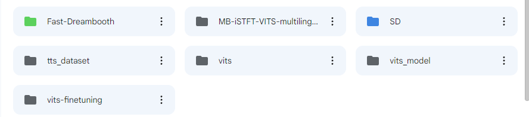
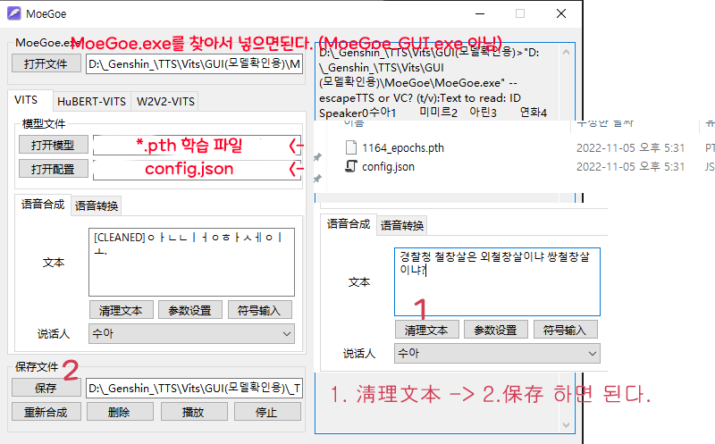
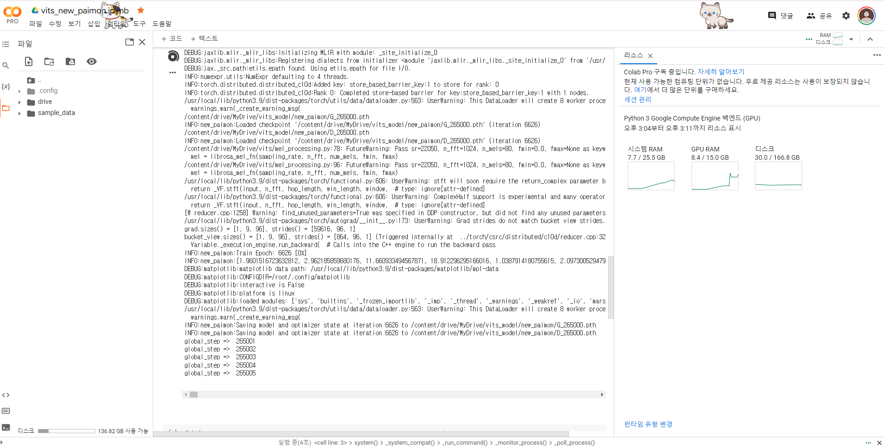

## vits

출처 : https://github.com/CjangCjengh/vits

출처 : https://github.com/jaywalnut310/vits

## 설명

한글 TTS를 만들기 위해 약간의 작업을 해두었습니다.

데이터셋만 만들면 나머지는 버튼만 누르면 될 정도로 쉽게 커스텀 해두었습니다.

데이터셋 예제는 다음과 같습니다.

싱글 speaker 기준
```
dataset/130061007_kr.wav|안녕히 가세요

즉 다시말하면

wav파일경로|음성명

여기서 잘못 설정하면 고생하니 잘 해야한다.
파이썬 정규식을 이용하면 빠르게 할 수 있다.
```

원신 데이터 셋은 첨부해둔 파일의 크롤링으로 얻을 수 있습니다.

학습은 구글 Colab에서 하는 것을 추천합니다.

자신의 구글드라이브를 다음과 같이 구성해야합니다.
```
└ tts_dataset
  └ 각각 이름 (ex paimon)
    └ train.txt
    └ val.txt
    └ wavs
      └ *.wav
└ vits_model (여기에 학습된 데이터 저장됨)
```
(다음과 같이 구성)



## 설명2
아니면 구글드라이브에 해당 vits를 직접 넣어서 하는 방법도 있다. (필자는 해당 방법을 추천)

저는 해당 방법을 통해 매번 clone하지 않고 직접 드라이브에 넣어서 학습하였습니다.

## 학습데이터로 음성 얻기

MoeGoe를 사용하면 매우 쉽게 음성을 얻을 수 있습니다.

[MoeGoe](https://github.com/CjangCjengh/MoeGoe)

중국어이기 때문에 간단히 번역해 두었습니다.

[사용법]



## 학습하기 성공

학습하기 성공하면 다음과 같은 결과가 나온다.

오랫동안 학습시켜두면 된다.



## 음성듣기 (Sample TTS)
[음성듣기 (Sample TTS)](https://kkt3343.github.io/vits/tts_sample_main.html)

